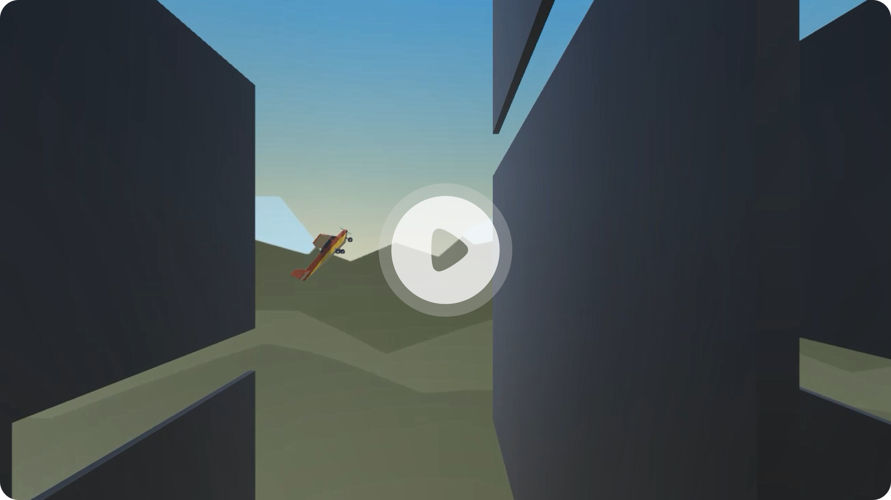

# Game-Up-Africa-Bootcamp-Exercise-1

Plane Programming - Use the skills you learned in the driving simulation to fly a plane around obstacles in the sky. Students will also have to keep the plane in view of the camera.

### Demo Video (Google Drive)

---

